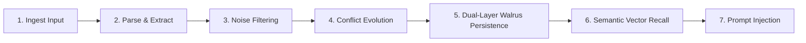

# Nue Memory — Master Product & Engineering Handoff

**Product:** Nue Memory  
**Tagline:** "The memory infrastructure layer for AI agents"  
**Organization:** NextMathLabs  
**Repository:** `/home/mateo/basement/Nue`  
**Date:** September 14, 2026  
**Status:** Core Architecture Built · Media Memory Modularized · Next.js 15 Production Ready  

---

## Table of Contents

1. [Product Vision & Hierarchy](#1-product-vision--hierarchy)
2. [The Core Problem Nue Solves](#2-the-core-problem-nue-solves)
3. [The 7-Stage Memory Lifecycle](#3-the-7-stage-memory-lifecycle)
4. [System Architecture](#4-system-architecture)
5. [Domain-Agnostic Memory Data Model](#5-domain-agnostic-memory-data-model)
6. [Dual-Layer Storage Encoding (Walrus MemWal)](#6-dual-layer-storage-encoding-walrus-memwal)
7. [Conflict Evolution & Contradiction Resolution](#7-conflict-evolution--contradiction-resolution)
8. [Developer SDK Specification](#8-developer-sdk-specification)
9. [Flagship Feature: Media Memory](#9-flagship-feature-media-memory)
10. [Livepeer Agent MCP Integration](#10-livepeer-agent-mcp-integration)
11. [Full Repository Directory Map](#11-full-repository-directory-map)
12. [UI/UX Specification & Brand Assets](#12-uiux-specification--brand-assets)
13. [Cryptographic & Network Infrastructure](#13-cryptographic--network-infrastructure)
14. [Step-by-Step Production Setup](#14-step-by-step-production-setup)
15. [Post-Hackathon Product Roadmap](#15-post-hackathon-product-roadmap)

---

## 1. Product Vision & Hierarchy

### What is Nue Memory?
Nue Memory gives AI agents **durable, structured, and evolving memory**.

AI agents can reason, plan, and invoke tools, but today almost all agents treat every conversation as a blank slate. Existing "memory" solutions merely dump unstructured chat transcripts into vector databases, stuffing noisy conversation turns into prompt windows without distinguishing ephemeral requests from durable preferences.

Nue Memory is the **decoupled memory infrastructure layer** that sits between AI agent runtimes (LangChain, LlamaIndex, CrewAI, AutoGen, custom agents) and decentralized durable storage (Sui Walrus via MemWal).

### Product Hierarchy

```text
┌────────────────────────────────────────────────────────────────────────┐
│                              Nue Memory                                │
│          The underlying memory infrastructure layer for AI agents      │
│  (Extraction · Evolution · Retrieval · SDK · Walrus Decentralized Store)│
└────────────────────────────────────────────────────────────────────────┘
                                    │
                                    ▼
┌────────────────────────────────────────────────────────────────────────┐
│                             Media Memory                               │
│            Flagship feature / first use case built on Nue              │
│       Demonstrates persistent agent memory in creative workflows       │
│                  Powered by Livepeer Agent & Sui Walrus                │
└────────────────────────────────────────────────────────────────────────┘
```

* **Nue Memory** is the real product. It is domain-agnostic, developer-facing infrastructure.
* **Media Memory** is the first user-facing application built on top of Nue Memory to prove persistent context in a live creative generation pipeline.
* Built for submission to the **Livepeer Agent Hackathon**, but architected as a standalone, production-grade product that continues beyond the hackathon under **NextMathLabs**.

---

## 2. The Core Problem Nue Solves

| Challenge | How Current Agents Handle It | How Nue Memory Solves It |
| :--- | :--- | :--- |
| **Noise vs. Signal** | Raw chat logs are stored verbatim. Temporary commands like *"make this video 5s shorter"* are saved alongside lasting preferences like *"I prefer short videos"*. | Evaluates natural language signals (`TEMPORARY_MARKERS` vs `PERSISTENT_MARKERS`) to discard session-specific noise and extract only durable preferences. |
| **Contradictory Accumulation** | If a user says *"I like dark mode"* in Session 1, and *"Switch to light mode"* in Session 4, vector search returns both, confusing the LLM. | **Conflict Evolution**: Detects semantic mutual exclusion pairs and supersedes older records with bidirectional links (`supersedesId` / `supersededById`). |
| **Context Window Bloat** | Unfiltered conversational history is stuffed into context windows, blowing token budgets and degrading model reasoning. | Formats compact, high-density prompt injection blocks containing only active, deduplicated, and ranked memory directives. |
| **Memory Provenance** | Agents cannot explain *why* they assumed a preference or where it originated. | Full audit ledger: every memory tracks source event, project origin, confidence score, creation timestamp, and decentralized blob ID. |
| **Storage Lock-In** | Memories are trapped inside proprietary centralized databases or model vendors. | Persisted as decentralized, verifiable blobs on **Sui Walrus**, ensuring user ownership and model portability. |

---

## 3. The 7-Stage Memory Lifecycle

Nue Memory processes agent interactions through a 7-stage deterministic lifecycle:



1. **Ingest Input**: Raw agent interactions, feedback reviews, or dialogue turns are submitted via SDK (`nue.add()`) or API (`/api/classify`).
2. **Parse & Extract**: Semantic extraction rules analyze the text against domain categories (`visual_style`, `pacing`, `typography`, `audio`, `layout`, `branding`, `workflow`).
3. **Noise Filtering**: Distinguishes one-off edits (*"trim frame 12"*, *"only for this version"*) from persistent preferences (*"always use large captions"*, *"by default use fast pacing"*). Temporary commands are routed to immediate execution without polluting long-term memory.
4. **Conflict Evolution**: Evaluates candidate memories against active stored records. Detects semantic contradictions (antonym pairs or single-slot replacements). Supersedes older records, marks them inactive, and preserves audit pointers.
5. **Dual-Layer Walrus Persistence**: Encodes memories into semantic headers + embedded metadata envelopes and stores them to **Sui Walrus** via the MemWal SDK.
6. **Semantic Vector Recall**: On subsequent agent runs, queries are matched using vector distance and keyword fallback, applying confidence, scope, and domain filters.
7. **Prompt Injection**: Recalled memories are orchestrated into a clean prompt block injected directly into the agent’s system instructions.

---

## 4. System Architecture

```text
┌─────────────────────────────────────────────────────────────────────────────┐
│                             AI Agent Runtimes                               │
│       LangChain  ·  LlamaIndex  ·  CrewAI  ·  AutoGen  ·  Livepeer Agent    │
└──────────────────────────────────────┬──────────────────────────────────────┘
                                       │
                                       ▼
┌─────────────────────────────────────────────────────────────────────────────┐
│                             Nue Memory SDK                                  │
│             nue.add()  ·  nue.search()  ·  nue.getContext()                 │
│              nue.evolve()  ·  nue.get()  ·  nue.delete()                    │
└──────────────────────────────────────┬──────────────────────────────────────┘
                                       │
                                       ▼
┌─────────────────────────────────────────────────────────────────────────────┐
│                           Nue Intelligence Engine                           │
│  ┌─────────────────────────┐ ┌──────────────────────┐ ┌───────────────────┐ │
│  │    Signal Extractor     │ │  Evolution Planner   │ │  Semantic Ranker  │ │
│  │ (Noise vs. Persistence) │ │ (Conflict Resolution)│ │ & Context Builder │ │
│  └─────────────────────────┘ └──────────────────────┘ └───────────────────┘ │
└──────────────────────────────────────┬──────────────────────────────────────┘
                                       │
                                       ▼
┌─────────────────────────────────────────────────────────────────────────────┐
│                     Walrus MemWal Storage Adapter                           │
│           Dual-Layer Payload Encoding  ·  Lossless JSON Reconstruction      │
└──────────────────────────────────────┬──────────────────────────────────────┘
                                       │
                                       ▼
┌─────────────────────────────────────────────────────────────────────────────┐
│                        Sui Walrus (MemWal Relayer)                          │
│               https://relayer.memory.walrus.xyz (Decentralized)             │
└─────────────────────────────────────────────────────────────────────────────┘
```

---

## 5. Domain-Agnostic Memory Data Model

The core schema is defined in [`lib/nue-memory/core/types.ts`](file:///home/mateo/basement/Nue/lib/nue-memory/core/types.ts):

```typescript
export type MemoryType = 'preference' | 'rule' | 'constraint' | 'fact' | 'pattern';
export type MemoryScope = 'global' | 'project' | 'session' | 'domain';

export interface MemorySource {
  type: 'user_feedback' | 'creative_brief' | 'explicit_statement' | 'system_inference';
  eventContext?: string; // e.g., "Project: SaaS Launch Promo"
  projectId?: string;
  timestamp: string;
}

export interface StructuredMemory {
  id: string;                         // Unique memory identifier (mem_...)
  userId: string;                     // Multi-tenant user partition
  type: MemoryType;                   // Classification of memory
  category: string;                   // Domain category (pacing, typography, audio, etc.)
  value: string;                      // The actual durable directive
  confidence: number;                 // Normalized confidence score (0.0 to 1.0)
  scope: MemoryScope;                 // Global vs Project vs Session scope
  domain: string;                     // media, coding, finance, general
  source: MemorySource;               // Provenance and attribution
  createdAt: string;                  // ISO 8601 creation timestamp
  updatedAt: string;                  // ISO 8601 update timestamp
  isActive: boolean;                  // Active for prompt injection vs superseded
  supersedesId?: string;              // ID of older contradictory memory this replaced
  supersededById?: string;            // ID of newer memory that replaced this record
  storageBlobId?: string;             // Walrus storage blob identifier
  metadata?: Record<string, unknown>; // Extensible metadata payload
}
```

---

## 6. Dual-Layer Storage Encoding (Walrus MemWal)

MemWal (`@mysten-incubation/memwal`) stores plain text blobs and computes embeddings for vector recall. To avoid maintaining a separate SQL database while preserving 100% loss-free structured metadata, Nue Memory implements **Dual-Layer Payload Encoding** in [`lib/nue-memory/storage/walrus-store.ts`](file:///home/mateo/basement/Nue/lib/nue-memory/storage/walrus-store.ts):

```text
┌─────────────────────────────────────────────────────────────────────────┐
│ Layer 1: Semantic Header (Token-optimized for MemWal vector embeddings)  │
│ [PREFERENCE|media|pacing] Prefer fast energetic introductions           │
├─────────────────────────────────────────────────────────────────────────┤
│ Layer 2: Metadata Envelope (Embedded JSON delimited by __NUE_META__)    │
│ __NUE_META__                                                            │
│ {"id":"mem_123","confidence":0.95,"source":{...},"supersedesId":"..."} │
│ __NUE_META__                                                            │
└─────────────────────────────────────────────────────────────────────────┘
```

* **On `save()`**: Encodes the memory object into this dual-layer string and invokes `client.rememberAndWait(payload, namespace)`.
* **On `search()` / `recall()`**: MemWal performs vector similarity search on Layer 1. Nue strips Layer 2, parses the embedded JSON, and reconstructs the exact `StructuredMemory` object with full provenance, audit links, and timestamps.

---

## 7. Conflict Evolution & Contradiction Resolution

The evolution engine in [`lib/nue-memory/engine/evolution.ts`](file:///home/mateo/basement/Nue/lib/nue-memory/engine/evolution.ts) ensures agents **never accumulate contradictions**.

### 1. Conflict Detection
Maintains mutual exclusion pairs and single-slot category rules:

```typescript
const CONFLICT_PAIRS: Array<[RegExp, RegExp, string]> = [
  [/dark (?:mode|interfaces?|theme)/i, /light (?:mode|interfaces?|theme)/i, 'Dark theme vs Light theme'],
  [/fast|energetic|brisk/i, /slow|calm|cinematic|gentle/i, 'Fast pacing vs Cinematic pacing'],
  [/large|bigger|prominent/i, /small|subtle|compact/i, 'Large captions vs Compact captions'],
  [/avoid|remove|no (?:dramatic|music)/i, /dramatic|orchestral|heavy music/i, 'Avoid music vs Favor music'],
  [/9:16|vertical|portrait/i, /16:9|widescreen|horizontal/i, '9:16 vertical vs 16:9 widescreen'],
];
```

### 2. Evolution Outcomes
When a new memory candidate arrives:
* **Duplicate**: Same value → **Reinforce** (increases confidence score, updates timestamp).
* **Contradiction**: Antonym match or single-slot collision → **Supersede** (marks older record `isActive: false`, writes `supersededById`, persists new record with `supersedesId`).
* **Complementary**: Non-conflicting attribute in same category → **Create** (added alongside existing records).

---

## 8. Developer SDK Specification

Exported via [`lib/nue-memory/sdk.ts`](file:///home/mateo/basement/Nue/lib/nue-memory/sdk.ts):

```typescript
import { MemoryClient, nue } from '@/lib/nue-memory/sdk';

const client = new MemoryClient({
  defaultUserId: 'user_123',
  defaultDomain: 'media',
});
```

### Methods Reference

#### `nue.add(input, options)`
Ingests dialogue turns or feedback. Separates temporary noise, checks conflicts, and persists structured objects.
```typescript
const result = await nue.add(
  "The intro is too slow. Make captions larger and remove dramatic strings.",
  { domain: 'media', sessionContext: 'Project A' }
);
// result.memories: StructuredMemory[] (active persisted records)
// result.evolutionPlans: EvolutionPlan[] (audit details)
// result.temporaryInstructions: string[] (filtered one-off instructions)
```

#### `nue.search(query, options)`
Retrieves active, ranked memories matching semantic intent.
```typescript
const memories = await nue.search("What are the user's video styling preferences?", {
  domain: 'media',
  limit: 5,
  minConfidence: 0.8,
});
```

#### `nue.getContext(query, options)`
Returns a pre-formatted agent prompt injection block.
```typescript
const context = await nue.getContext("Create promo video", { domain: 'media' });
console.log(context.injectedContextBlock);
/*
[Nue Persistent Memory Context]:
- [PACING]: Prefer fast, energetic introductions and brisk cut pacing (confidence: 94%)
- [TYPOGRAPHY]: Prefer large, high-contrast, easily readable captions (confidence: 95%)
- [AUDIO]: Avoid dramatic cinematic strings; prefer subtle ambient beds (confidence: 93%)
*/
```

#### `nue.evolve(oldMemoryId, newMemoryData)`
Explicitly supersedes an outdated memory with a newer directive.

#### `nue.get(id)`, `nue.update(id, updates)`, `nue.delete(id)`
Standard CRUD operations with Walrus blob synchronization.

---

## 9. Flagship Feature: Media Memory

Located in dedicated directory [`lib/nue-memory/media-memory/`](file:///home/mateo/basement/Nue/lib/nue-memory/media-memory/):

```text
lib/nue-memory/media-memory/
├── types.ts          # CreativeProject, MediaVersion, MediaPreference
├── extractor.ts      # classifyFeedback()
├── evolution.ts      # evolveMemories(), consolidateMemories()
├── retrieval.ts      # retrieveAndEnrichBrief()
├── livepeer-agent.ts # LivepeerMediaAgent MCP client
├── service.ts        # MemWalService bridge
└── index.ts          # Barrel export
```

### The 2-Project Verification Flow

1. **Project A (SaaS App Launch Promo)**:
   * User prompts: *"Create a 20-second product promo for my new app."*
   * Livepeer Agent generates Version 1 (baseline settings: moderate pacing, medium captions, energetic music).
   * User leaves review feedback: *"The intro is too slow. Make the captions much larger and remove the dramatic music."*
   * Nue extraction engine classifies feedback:
     * Identifies 3 durable preferences: `pacing` (fast), `typography` (large captions), `audio` (avoid dramatic strings).
     * Displays **Memory Confirmation Modal** ("Remember this for future media?").
   * User clicks **"Remember in Walrus Memory"**:
     * Persists structured records with Walrus blob IDs.
     * Agent generates Version 2 applying fast pacing and large captions.
2. **Project B (Minimalist Clothing Promo) — Zero-Reprompt Cross-Session Recall**:
   * User switches to Project B: *"Create a promo for my new clothing brand."*
   * Nue automatically queries Walrus MemWal, recalls the 3 active preferences, and constructs the enriched brief.
   * Livepeer Agent synthesizes Version 1 with fast pacing and large captions **without the user repeating their instructions**.
3. **Prompt Inspector Modal**:
   * Inspects the 3-stage pipeline: Original brief → Retrieved Walrus memories → Augmented prompt injection block.

---

## 10. Livepeer Agent MCP Integration

Implemented in [`lib/nue-memory/media-memory/livepeer-agent.ts`](file:///home/mateo/basement/Nue/lib/nue-memory/media-memory/livepeer-agent.ts):

* **Endpoint**: `https://agent.livepeer.org/api/mcp/creative`
* **Protocol**: Model Context Protocol (MCP) JSON-RPC 2.0 over HTTP.
* **Tool Invocation**: `create_media` tool:
  ```json
  {
    "jsonrpc": "2.0",
    "method": "tools/call",
    "params": {
      "name": "create_media",
      "arguments": {
        "action": "generate",
        "prompt": "Create a promo for my clothing brand... Visual style: Contemporary Urban Apparel. Pacing: fast. Composition: 16:9.",
        "prefer_fast": true
      }
    }
  }
  ```
* **Capabilities**: Generates video streams and thumbnail keyframes via Livepeer pipeline (`flux-schnell` + `pixverse-t2v`).

---

## 11. Full Repository Directory Map

```text
Nue/
├── app/
│   ├── api/
│   │   ├── classify/route.ts      # POST: Feedback classification via Nue extractor
│   │   ├── generate/route.ts      # POST: Context enrichment & Livepeer generation
│   │   └── memwal/route.ts        # GET/POST: MemWal read, remember, forget, reset
│   ├── favicon.ico                # Background-preserved favicon
│   ├── globals.css                # Tailwind CSS styling & custom scrollbars
│   ├── layout.tsx                 # Root layout with Geist & JetBrains Mono fonts
│   └── page.tsx                   # Main orchestrator (Landing Page vs Dashboard views)
│
├── components/
│   ├── dashboard/
│   │   ├── ApiKeysView.tsx        # Developer API key management
│   │   ├── DocsView.tsx           # Interactive SDK documentation
│   │   ├── MediaMemoryWorkspace.tsx # Creative studio split layout
│   │   ├── MemoriesView.tsx       # Transparency ledger (All, Active, Superseded tabs)
│   │   ├── NueDashboard.tsx       # Dashboard shell with top navigation
│   │   ├── OverviewView.tsx       # Infrastructure telemetry & system health
│   │   └── ProjectsView.tsx       # Multi-project workspace switcher
│   ├── landing/
│   │   ├── DifferentiatorSection.tsx # Memory vs. conversation logging
│   │   ├── EvolutionSection.tsx   # Contradiction resolution diagrams
│   │   ├── HeroSection.tsx        # High-impact hero with technical typography
│   │   ├── LandingFooter.tsx      # NextMathLabs footer with quick links
│   │   ├── LifecycleSection.tsx   # 7-stage lifecycle interactive visualization
│   │   ├── MediaMemoryShowcase.tsx # Flagship feature demo showcase
│   │   ├── MemoryObjectsSection.tsx # JSON schema comparison
│   │   └── QuickstartSection.tsx  # Python & TypeScript SDK code tabs
│   ├── AgentChat.tsx              # Livepeer agent chat panel
│   ├── EnrichedBriefModal.tsx     # Context orchestration inspector
│   ├── MediaPreview.tsx           # HTML5 video player with pacing/audio overlays
│   ├── MemoryConfirmation.tsx     # Human-in-the-loop memory confirmation card
│   ├── MemoryPanel.tsx            # Slide-over Walrus memory vault drawer
│   ├── NueLogo.tsx                # Brand logo renderer
│   └── NueNavbar.tsx              # Sticky navbar with Vault drawer trigger
│
├── lib/
│   ├── nue-memory/
│   │   ├── core/types.ts          # Domain-agnostic StructuredMemory schema
│   │   ├── storage/walrus-store.ts # Sui Walrus MemWal SDK adapter
│   │   ├── engine/
│   │   │   ├── extractor.ts       # Signal analysis & noise separation
│   │   │   ├── evolution.ts       # Conflict resolution & supersession
│   │   │   └── retrieval.ts       # Context formatting & prompt injection
│   │   ├── sdk.ts                 # MemoryClient developer SDK
│   │   └── media-memory/          # 📁 Dedicated Media Memory feature module
│   │       ├── types.ts           # Media domain types
│   │       ├── service.ts         # MemWalService bridge
│   │       ├── extractor.ts       # classifyFeedback()
│   │       ├── evolution.ts       # evolveMemories()
│   │       ├── retrieval.ts       # retrieveAndEnrichBrief()
│   │       ├── livepeer-agent.ts  # Livepeer MCP client
│   │       └── index.ts           # Public module barrel
│   ├── livepeer/agent.ts          # Backward-compatibility bridge
│   ├── walrus-memwal/client.ts    # Backward-compatibility bridge
│   └── types.ts                   # Root types re-export bridge
│
├── public/
│   ├── favicon.ico                # Preserved original background favicon
│   ├── logo-transparent.png       # In-app transparent pixel horse logo (isolated)
│   └── logo.jpg                   # Original uploaded brand image
│
├── handoff.md                     # This master product and engineering handoff
├── package.json                   # Dependencies: Next.js 15, MemWal, Lucide, Tailwind
└── tsconfig.json                  # Strict TypeScript configuration
```

---

## 12. UI/UX Specification & Brand Assets

### Visual Aesthetics
* **Theme**: Deep obsidian canvases (`#0c0a09`) with warm stone tones (`#1c1815`, `#26211d`), honey caramel accents (`#c88d51`), and crisp typography.
* **Buttons**: Clean, rectangular geometries with subtle borders (`rounded-md`, avoiding generic pill shapes).
* **Typography**: Clean sans-serif for UI headings, JetBrains Mono for telemetry, payload JSON, and code blocks.

### Brand Assets & Design Contract
* **In-App Logo ([`/logo-transparent.png`](file:///home/mateo/basement/Nue/public/logo-transparent.png))**: Background completely removed. Isolates only the pixel horse mark with `[image-rendering:pixelated]` enabled in [`components/NueLogo.tsx`](file:///home/mateo/basement/Nue/components/NueLogo.tsx).
* **Favicon ([`/favicon.ico`](file:///home/mateo/basement/Nue/public/favicon.ico))**: Original background preserved intact.

---

## 13. Cryptographic & Network Infrastructure

### Sui Walrus MemWal Integration
Nue Memory connects to the decentralized Walrus Memory network via the official `@mysten-incubation/memwal` SDK:

```typescript
import { MemWal } from '@mysten-incubation/memwal';

const client = MemWal.create({
  key: process.env.MEMWAL_PRIVATE_KEY!,     // Sui Ed25519 private key
  accountId: process.env.MEMWAL_ACCOUNT_ID!, // Sui account address (0x...)
  serverUrl: process.env.MEMWAL_SERVER_URL || 'https://relayer.memory.walrus.xyz',
  namespace: 'nue-memory',
});
```

### Delegation & Verification
1. **Delegate Signing**: The Ed25519 key signs memory payloads on behalf of the agent runtime.
2. **On-Chain Attestation**: MemWal stores encoded blobs across Walrus decentralized storage nodes and registers index pointers.
3. **Cryptographic Provenance**: Blob IDs returned from `rememberAndWait` represent tamper-proof content hashes on Walrus.

---

## 14. Step-by-Step Production Setup

### 1. Prerequisites
* Node.js >= 20.0.0
* npm >= 10.0.0

### 2. Environment Configuration
Create `.env.local` in the project root:

```bash
# --- Sui Walrus Decentralized Memory (Required for Live On-Chain Persistence) ---
MEMWAL_PRIVATE_KEY=your_ed25519_private_key
MEMWAL_ACCOUNT_ID=your_sui_account_id
MEMWAL_SERVER_URL=https://relayer.memory.walrus.xyz

# --- Livepeer Agent (Required for Remote MCP Media Synthesis) ---
LIVEPEER_API_KEY=your_livepeer_api_key
LIVEPEER_AGENT_MCP_URL=https://agent.livepeer.org/api/mcp/creative
```

> **Note on Mock Mode**: When `MEMWAL_PRIVATE_KEY` is not provided, the SDK initializes `MemWalMock` locally in memory for offline development. To ensure live network verification, always provide valid Walrus keys.

### 3. Build & Run
```bash
# Install dependencies
npm install

# Build production bundle (verified 0 type or lint errors)
npm run build

# Start production server on port 3000
npm run start -- -p 3000
```

---

## 15. Post-Hackathon Product Roadmap

```text
Q4 2026: Nue Developer Preview
├── Livepeer Agent Hackathon Submission (Media Memory Showcase)
├── Python SDK release (pip install nue-ai)
└── Sui Walrus Testnet/Mainnet delegate key management portal

Q1 2027: Multi-Domain Expansion
├── Coding Memory (@nue-memory/coding): Developer preferences, AST conventions, repo rules
├── Enterprise Tenant Namespaces (Isolated cryptographic partitions per customer)
└── LangChain & LlamaIndex Official Memory Provider Plugins

Q2 2027: Decentralized Memory Network
├── Dedicated Walrus Memory indexer nodes
├── Collaborative Shared Agent Memory (Teams sharing verified agent context)
└── Zero-Knowledge Memory Proofs (Selective memory disclosure without revealing raw text)
```

---

*Authored by Antigravity on behalf of NextMathLabs for the Nue Memory Project.*
